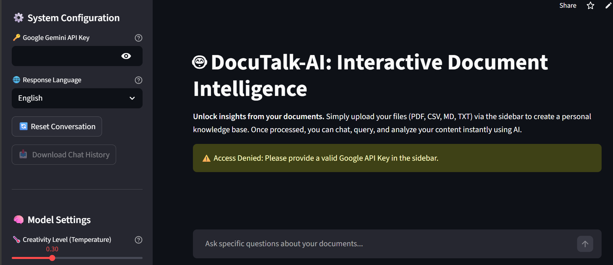
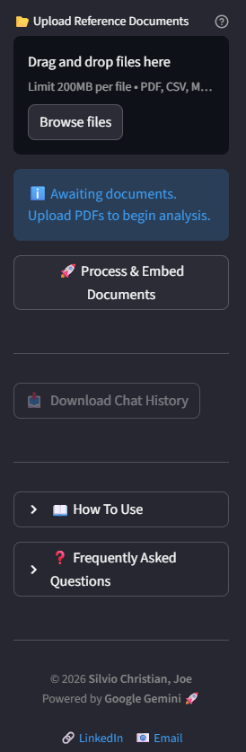
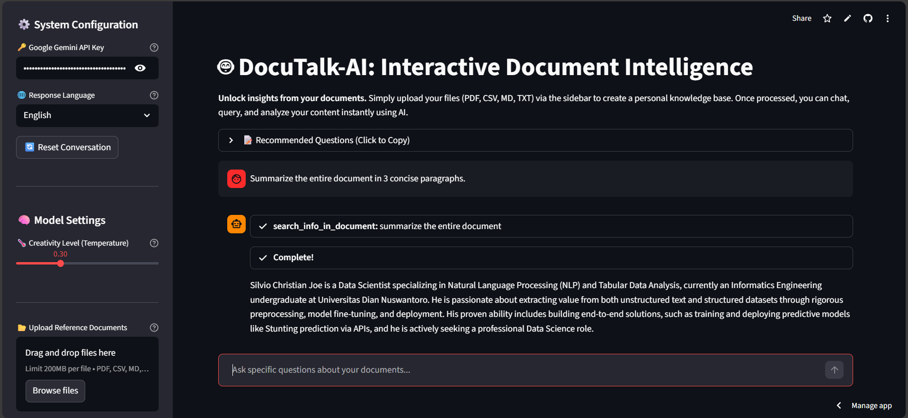

# 📚 DocuTalk-AI (Smart Document Assistant)


## 📌 Overview
**DocuTalk-AI** is an intelligent retrieval-augmented generation (RAG) application powered by Google's **Gemini 2.5 Flash**.

Unlike basic chatbots, this system employs a **ReAct (Reasoning + Acting) Agent** architecture. It intelligently decides whether to answer questions based on your uploaded **Knowledge Base (PDF, CSV, TXT, MD)** or via **Web Search (DuckDuckGo)** if the document lacks specific information. It features incremental indexing, strict language control, and session management.

## ✨ Key Features

### 🧠 Smart RAG & Agentic Workflow
Powered by `LangChain`, the app creates a "Brain" that follows a strict priority protocol:
1.  **Priority 1:** Check Uploaded Documents (Vector Search via FAISS).
2.  **Priority 2:** Use Internal Knowledge.
3.  **Priority 3:** Web Search (Fallback if info is missing).

### ⚡ Cost-Efficient Incremental Indexing
* **Smart Processing:** The app tracks filenames (`processed_files` state). If you add a new file to an existing batch, it **only processes the new file** without re-embedding the old ones.
* **Optimization:** Saves time and API quota by appending to the existing FAISS vector store instead of rebuilding it from scratch.

### 🌐 Strict Language Enforcement
Features a custom "Translator-Researcher" prompt injection.
* **User Control:** Select **English** or **Indonesian** in the sidebar.
* **Behavior:** The AI ignores the source document's language and forces the final output into your selected language (e.g., querying an English Journal but getting the answer in Indonesian).

### 🛠️ Advanced Session Management
* **Chat History Export:** Download your entire conversation analysis as a JSON file.
* **Memory Handling:** Uses `ConversationSummaryMemory` to maintain context without overloading the token limit.
* **Safety Rails:** Robust error handling for API Quotas (429), Invalid Keys, and Empty/Corrupt Files.

### ⚙️ Customizable Intelligence
* **Creativity Slider:** Adjust the `temperature` (0.0 - 1.0) to switch between strict fact-extraction and creative summarization.
* **Visual Thinking:** Real-time visibility into the Agent's thought process (Observation -> Thought -> Action) via `StreamlitCallbackHandler`.

## 🛠️ Tech Stack
* **LLM:** Google Gemini 2.5 Flash.
* **Framework:** Streamlit.
* **Orchestration:** LangChain (Agents, Tools, Chains).
* **Vector Database:** FAISS (In-memory).
* **Embeddings:** GoogleGenerativeAIEmbeddings (`models/gemini-embedding-001`).
* **Search Tool:** DuckDuckGo Search Run.

## 📦 Installation

1.  **Clone the Repository**
    ```bash
    git clone https://github.com/viochris/DocuTalk-AI
    cd DocuTalk-AI
    ```

2.  **Install Dependencies**
    ```bash
    pip install -r requirements.txt
    ```

3.  **Run the Application**
    ```bash
    streamlit run file.py
    ```

## 🚀 Usage Guide

1.  **Setup:**
    * Get your API Key from [Google AI Studio](https://aistudio.google.com/).
    * Enter the key in the sidebar.
3.  **Configuration:**
    * Choose **Response Language** (English/Indonesian).
    * Adjust **Creativity Level**.
4.  **Build Knowledge Base:**
    * Upload your documents (**PDF, CSV, MD, or TXT**).
    * Click **"🚀 Process & Embed Documents"**.
    * *Wait for the "Successfully added" toast notification.*
5.  **Chat & Analyze:**
    * Ask questions like *"Summarize the methodology"* or *"Analyze the data trends in the CSV"*.
    * Use the **Recommended Questions** expander for quick start ideas.
6.  **Export:**
    * Click **"📥 Download Chat History"** to save your insights.

## ⚠️ Limitations
* **Session Volatility:** Since FAISS is stored in RAM (Session State), refreshing the browser will clear the document index.
* **API Quotas:** Heavy usage of the Embedding model or LLM may hit Google's free tier rate limits (captured by the app's error handling).

## 📷 Gallery

### 1. Landing Interface
  
*The clean, user-friendly landing page welcoming users to DocuTalk-AI. It features a clear call-to-action for uploading documents and initializing the secure environment.*

### 2. Comprehensive Sidebar Controls
  
# 🚀 Chat with Vio (Portfolio AI Assistant)


## 📌 Overview
**Chat with Vio** is a personalized AI Assistant designed to showcase the professional profile of **Silvio Christian Joe**. 

Powered by **Google Gemini 2.5 Flash** and **RAG (Retrieval Augmented Generation)** technology, this application allows recruiters and visitors to "chat" with Silvio's resume. Instead of reading a static CV, users can ask questions like *"What is Vio's tech stack?"* or *"Tell me about his data science projects,"* and get accurate, cited answers derived directly from his profile data.

## ✨ Key Features

### 🧠 Specialized RAG Architecture
Unlike generic chatbots, this system is grounded in a specific knowledge base (`silvio_profile.json`).
* **Vector Search:** Uses **FAISS** to index Silvio's profile into vector embeddings.
* **Contextual Retrieval:** Retrieves only the relevant parts of the profile to answer specific user queries.

### 🌐 Strict Language Enforcement
Features a custom "Translator-Representative" prompt injection.
* **User Control:** Select **English** or **Indonesian** in the sidebar.
* **Behavior:** The AI acts as a bilingual representative. Even if the source data is in English, it will fluently answer in Indonesian if selected (and vice versa) without losing context.

### 📱 Responsive & Modern UI
* **Custom CSS:** Injects specific media queries to ensure the interface looks perfect on **Laptops, Tablets, and Mobile phones**.
* **Interactive Elements:** Features custom HTML cards, toast notifications (`st.toast`), and a polished sidebar layout.

### 🛡️ Anti-Hallucination & Safety
* **Strict Prompt Engineering:** The AI is instructed to **ONLY** answer based on the provided context. If asked about unknown facts (e.g., "Can Vio fly a plane?"), it politely declines rather than making things up.
* **Error Handling:** Robust handling for API Quota limits (429), Invalid API Keys, and content safety filters.

### 💾 Session Management
* **Chat History Export:** Users can download the entire conversation as a JSON file for reference.
* **State Preservation:** Uses `st.session_state` to maintain chat history and vector stores even when interacting with UI buttons.

## 🛠️ Tech Stack
* **LLM:** Google Gemini 2.5 Flash (`gemini-2.5-flash`).
* **Framework:** Streamlit.
* **Orchestration:** LangChain (`ConversationalRetrievalChain`).
* **Vector Database:** FAISS (CPU).
* **Embeddings:** Google Generative AI Embeddings (`models/gemini-embedding-001`).
* **Data Source:** JSON-based textual profile.

## 📦 Installation

1.  **Clone the Repository**
    ```bash
    git clone https://github.com/viochris/personal-ai-assistant.git
    cd personal-ai-assistant
    ```

2.  **Install Dependencies**
    ```bash
    pip install -r requirements.txt
    ```

3.  **Prepare Data**
    Ensure you have your profile data stored in:
    `data/silvio_profile.json`

4.  **Run the Application**
    ```bash
    streamlit run app.py
    ```

## 🚀 Usage Guide

1.  **Setup:**
    * Get your API Key from [Google AI Studio](https://aistudio.google.com/).
    * Enter the key in the sidebar configuration.
2.  **Initialize:**
    * Click the **"📂 Load Knowledge Base"** button.
    * *Wait for the "System is ready" toast notification.*
3.  **Customize:**
    * Select your preferred **Response Language** (English/Indonesian).
4.  **Chat:**
    * Ask questions like *"What are your skills?"* or *"How can I contact you?"*.
5.  **Export:**
    * Click **"📥 Download Chat History"** at the bottom of the sidebar to save the session.

## 📷 Gallery

### 1. Landing Interface
  
*The clean, user-friendly landing page welcoming users to the assistant. It features a clear call-to-action for initializing the secure environment.*

### 2. Comprehensive Sidebar Controls
  
*The remaining part of the sidebar configuration that is not visible in the Home UI screenshot.*

### 3. Interactive Chat & Context
  
*The core experience in action. The chat interface enables natural language queries, displaying precise answers derived directly from the uploaded content.*

## ⚠️ Limitations
* **Session Volatility:** Since FAISS is stored in RAM, refreshing the browser will clear the conversation and requiring a reload of the Knowledge Base.
* **Static Data:** The AI only knows what is written in the `silvio_profile.json` file. It does not browse the live internet.

---
**Author:** [Silvio Christian, Joe](https://www.linkedin.com/in/silvio-christian-joe)
*"Turning a static CV into an interactive conversation."*


### 3. Interactive Analysis & Chat
  
*The core experience in action. Once documents are processed, the chat interface enables natural language queries, displaying precise answers derived directly from the uploaded content.*

---
**Author:** [Silvio Christian, Joe](https://www.linkedin.com/in/silvio-christian-joe)
*"Unlock insights from your documents instantly."*
